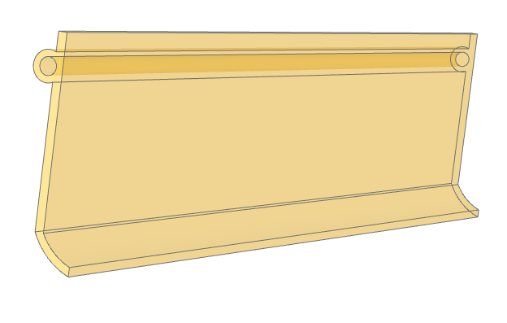

# b3d_mailbox_flap
Parametric 3D model of a mailbox flap, made with build123d.  

This mailbox flap, although parametric, is best suited to a standard French mailbox.  
We strongly recommend that you print it in a weather-resistant material, perhaps ASA, PETG, etc.  
When printing, orient the length of the flap along the Z axis, to avoid supports and, above all, the impossibility of managing clearance for the support bar.  
Once printed, this mailbox flap can be installed as a replacement for the old flap, on an aluminum rod.  

